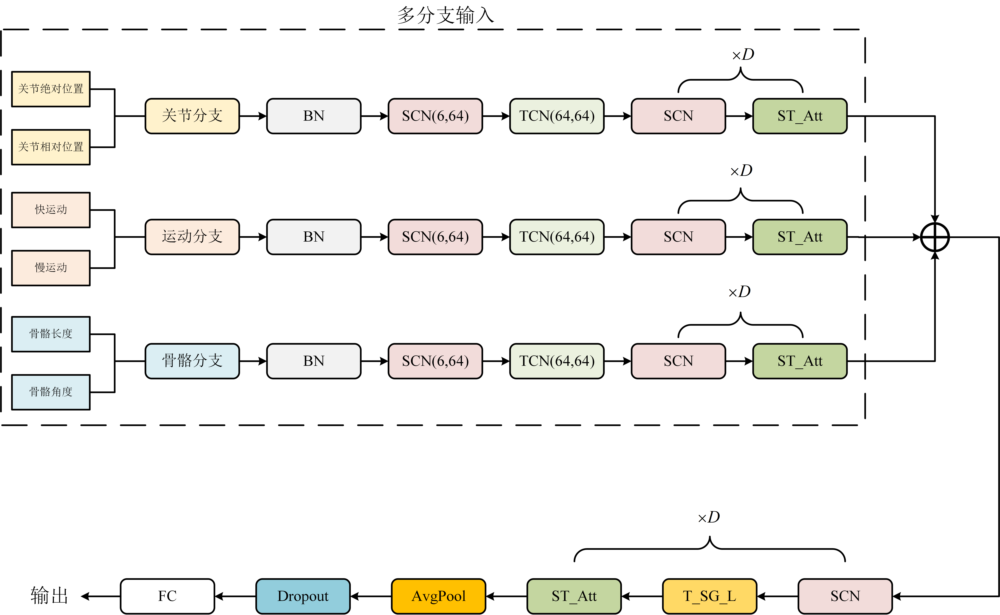
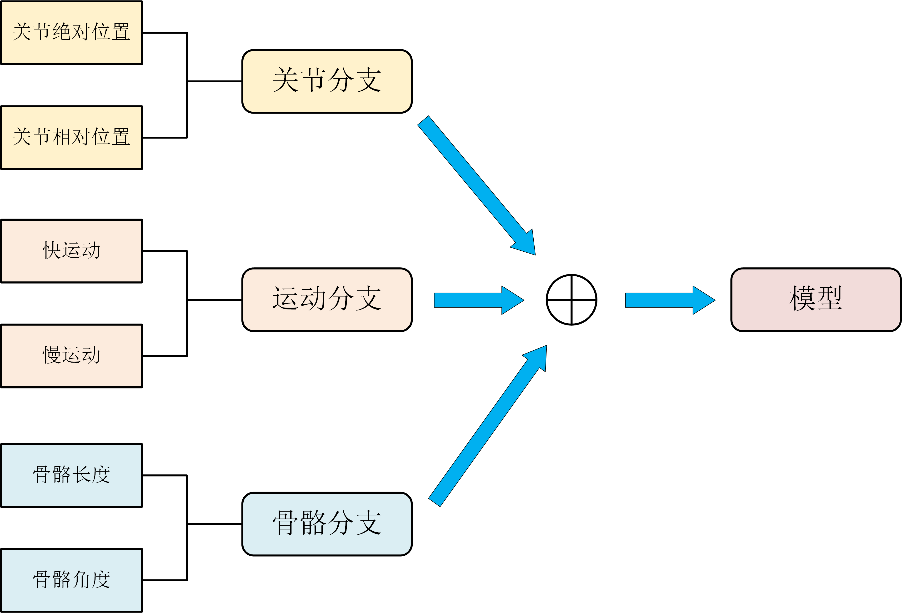
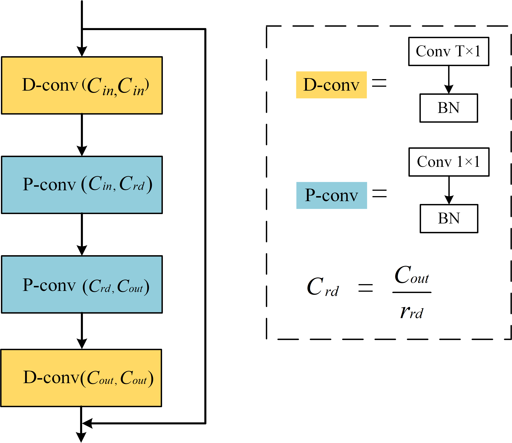
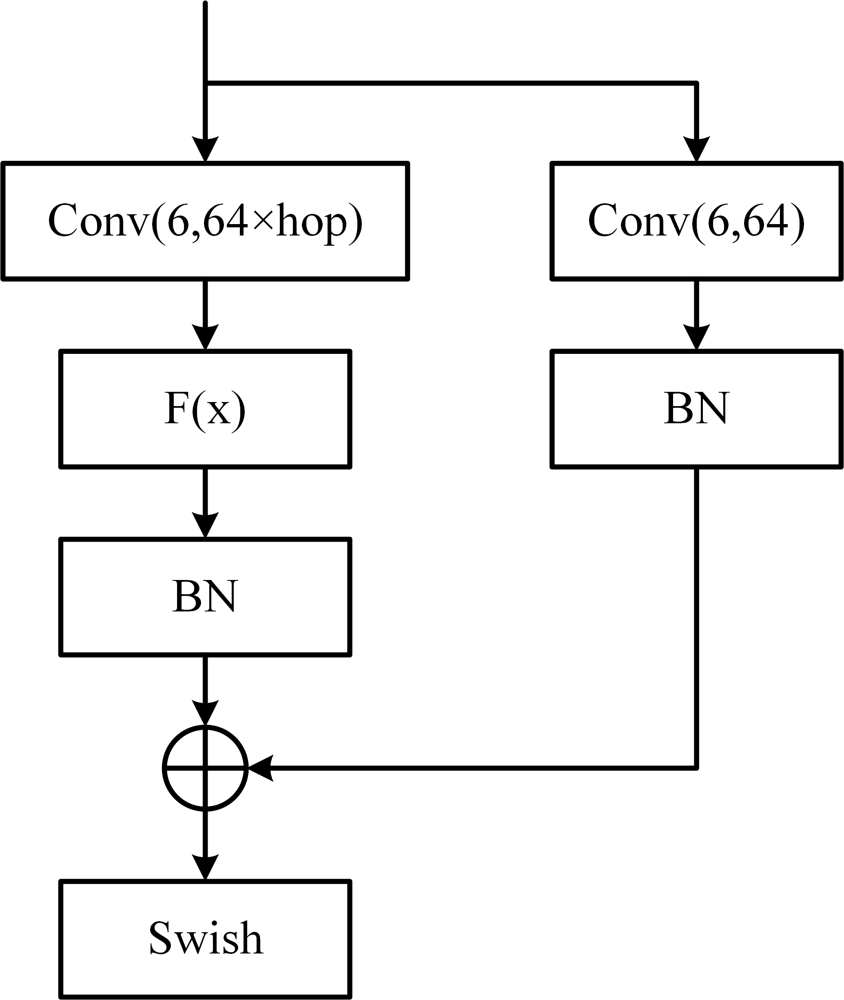
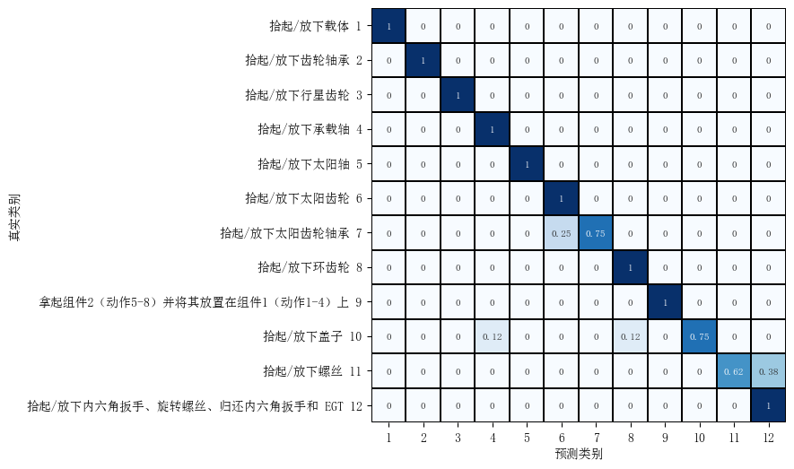
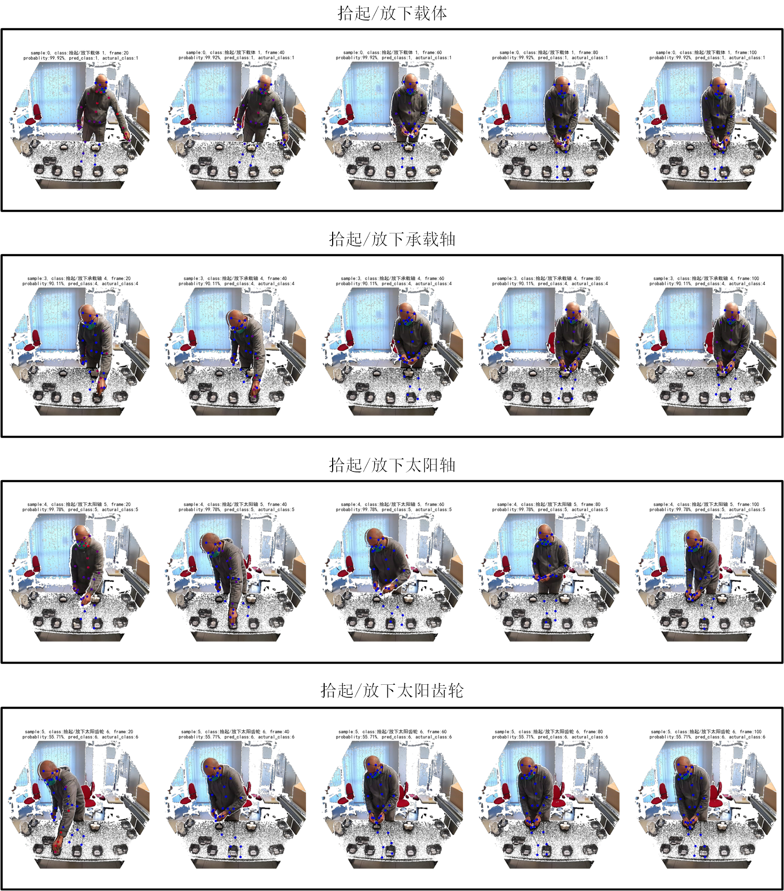

<h3 align="center">基于深度学习的动作识别系统</h3>

一种基于深度学习的工人装配动作识别系统，通过提出轻量化模型Light-STGCN，以实时监测和分析工人在生产线上的装配行为。

## 一、模型框架

Light_ST_GCN模型结构如图所示。在多分支输入模块，对于每个输入分支，首先批量归一化处理，接着经过SCN层、TCN层进行空间卷积操作，再进行D次SCN+ST_Att操作，其中D为超参数。
对3个分支的特征进行拼接后，对特征进行D次的SCN+T_SG_L+ST_Att处理操作。最后进行平均池化、dropout层和全连接层后，得到输出。

## 二、模型各模块

### 2.1 多输入分支架构
考虑3种分支，分别为关节、运动和骨骼，具体如下。

关节分支：关节绝对位置和相对位置。绝对位置是指关节的原始3D坐标，相对位置是指，每个关节相对于中心关节的坐标差。 
运动分支：分为慢运动和快运动，慢运动为相邻1帧之间关节点的位置变化，快运动为相邻2帧之间关节点的位置变化。 
骨骼分支：骨骼特征。分为骨骼长度和骨骼角度。  

### 2.2 时间卷积层Temporal_SG_Layer
在对不同帧的特征信息进行处理时，采用基于可分离卷积的时间卷积层。Temporal_SG_Layer的设计如图所示。

在Temporal_SG_Layer中，首先将特征进行深度卷积，深度卷积核为T×1，填充大小为(T-1)/2，步幅为1；接着进行2次逐点卷积，逐点卷积核为1×1，无填充，最后进行深度卷积，每次卷积后进行批量归一化。同时，在该层中加入残差块跳跃连接。

### 2.3 空间卷积层Spatial_Graph_Layer
采用空间卷积层处理同一帧下的特征信息，Spatial_Graph_Layer的设计如图所示。

首先，在主干部分，对输入进行(6,64×hop)的卷积处理，其中hop表示不同关节的跳数，如当hop=3，表示分别对相距1、2、3的节点信息进行处理。接着通过F(x)对特征进行加权，在残差部分进行(6,64)的卷积和归一化处理。最后将主干部分和残差部分的输出相加，再通过swish激活函数得到特征。

### 2.4 时空联合注意力机制
通常，在其它注意力机制中，只考虑单个通道（时间或空间）的信息，然而，空间和时间信息可能是彼此相关的，因此，将时间和空间信息联合处理，结构如图所示。

输入特征分别在帧数和关节上进行平均池化，并将池化特征向量通过全连接层FC，批量归一化BN以及Hardswish激活。接着，通过2个卷积层得到时间注意力分数和空间注意力分数，最终，将2个分数相乘得到全注意力分数。

## 三、实验
### 3.1 数据集
本模块采用Human Action Multi-Modal Monitoring in Manufacturing (HA4M) 数据集，其由41名受试者执行了12个动作组成的装配任务，并采集了相关的骨骼数据。
该数据集采用微软Azure Kinect摄像头在装配任务执行期间获取视频，采集设置如图4-1所示。将微软Azure Kinect摄像头放置在操作员前方的三脚架上，距离地面高度h = 1.54 m，距离桌子远端边界水平距离d = 1.78 m，相机向下倾斜到一个角度α = 17。

### 3.2 实验结果
测试集的热力图如图所示，在预测的所有动作类别中，其中9个动作类别的准确率达100%，动作类别7的准确率为75%，但其所有的误判均为动作类别6，概率为25%，有可能是因为动作6和动作7的相识度高。动作10的准确率为75%，其中误判为动作4和动作8的概率均为12.5%，动作11的准确率为62.5%，但其所有的误判均为动作类别12，概率为37.5%。

为验证模型相比其它模型的优越性，在公开数据集NTU 120 dataset上进行测试，在保证模型训练参数相同的情况下，所得实验结果如表所示。在准确率上，我们模型最佳，为92.1%。在模型计算上，我们模型计算成本（FLOPs）最小，为4.05G。在模型参数大小上，我们模型仅含0.51M大小参数。

  
| 模型      | Acc    | FLOPs(G)   | Param(M)     | 
| :-------: | :----: | :----: | :------: |
| ST-GCN	| 81.5	| 16.32	| 3.10 |
| SR-TSL	|84.8|	4.20|	19.07|
| AS-GCN	|86.8	|26.76	|9.50|
| 2s-AGCN|	88.5	|37.32	|6.94|
|**Ours**	|**92.1**	|**4.05**	|**0.51**|

图中为其中四种动作的示例。

